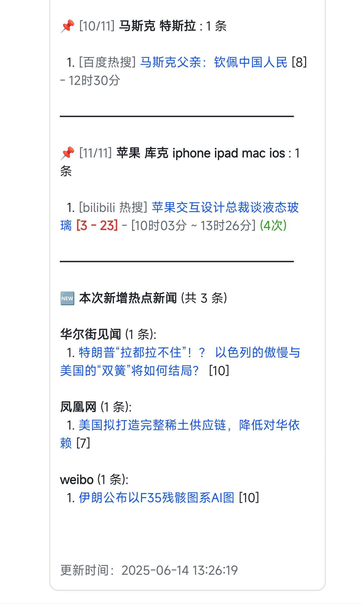
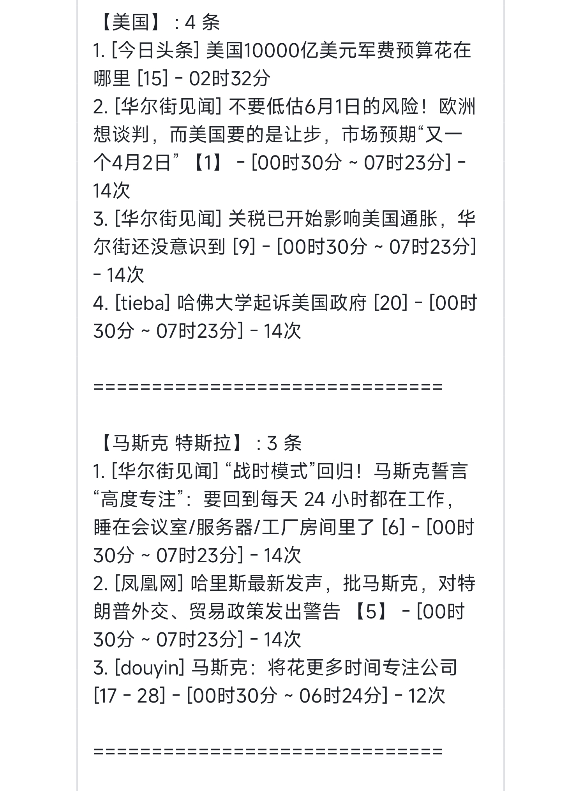
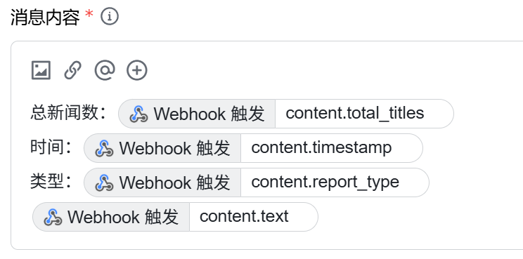
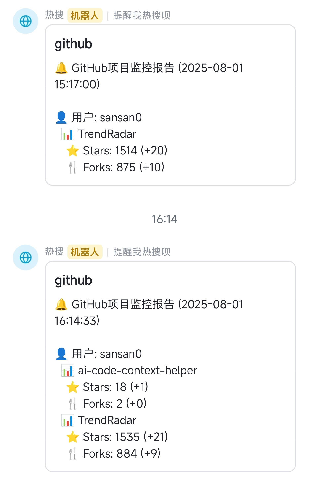

<div align="center">

# 🎯TrendRadar

<strong>🚀 最快一分钟部署的热点助手 —— 告别无效刷屏，只看真正关心的新闻资讯</strong>

[](https://github.com/sansan0/TrendRadar/stargazers)
[](https://github.com/sansan0/TrendRadar/network/members)
[](LICENSE)
[](https://github.com/sansan0/TrendRadar)

[](https://work.weixin.qq.com/)
[](https://telegram.org/)
[](#)
[](https://www.feishu.cn/)
[](https://github.com/sansan0/TrendRadar)
[](https://sansan0.github.io/TrendRadar)
[](https://hub.docker.com/)

</div>


> 本项目以轻量，易部署为目标，主要处理 issues
>
> 遇到问题提 issues，或【硅基茶水间】公众号留言
>
> 附项目相关的两篇文章，欢迎留言交流
>
> 1. [2个月破 1000 star，我的GitHub项目推广实战经验](https://mp.weixin.qq.com/s/jzn0vLiQFX408opcfpPPxQ)
> 2. [基于本项目，如何开展公众号或者新闻资讯类文章写作](https://mp.weixin.qq.com/s/8ghyfDAtQZjLrnWTQabYOQ)

## ✨ 核心功能

### **全网热点聚合**

- 今日头条
- 百度热搜
- 华尔街见闻
- 澎湃新闻
- bilibili 热搜
- 财联社热门
- 凤凰网
- 贴吧
- 微博
- 抖音
- 知乎

默认监控 11 个主流平台，如想额外增加，可看最下方的**自定义监控平台**

### **智能推送策略**

三种推送模式：

- **📈 投资者/交易员** → 选择 `incremental`，及时获取新增资讯
- **📰 自媒体人/内容创作者** → 选择 `current`，掌握实时热点趋势  
- **📋 企业管理者/普通用户** → 选择 `daily`，定时获取完整日报

### **精准内容筛选**

设置个人关键词（如：AI、比亚迪、教育政策），只推送相关热点，过滤无关信息

### **多渠道实时推送**

支持**企业微信**、**飞书**、**钉钉**、**Telegram**，消息直达手机

### **零技术门槛部署**

GitHub 一键 Fork 即可使用，无需编程基础。

> 如果要手机接收通知， 要达到 1 分钟部署完毕的效果，请选择**企业微信**

### **减少 APP 依赖**

从"被算法推荐绑架"变成"主动获取自己想要的信息"

**适合人群：** 投资者、自媒体人、企业公关、关心时事的普通用户

**典型场景：** 股市投资监控、品牌舆情追踪、行业动态关注、生活资讯获取

**💡 提示：** 想要网页版？进入你的仓库 Settings → Pages，启用 GitHub Pages。比如我这里[TrendRadar](https://sansan0.github.io/TrendRadar/)。

<p align="center">
  
</p>

<details>
<summary><strong>👉 点击查看推送格式说明</strong></summary>

## 📊 输出示例

### 通知示例：

```
📊 热点词汇统计

🔥 人工智能 AI : 12 条

  1. [百度热搜] 科技巨头发布新AI模型 [1] - 12时30分 (4次)

  2. [今日头条] AI技术最新突破 [2] - [13时15分 ~ 14时30分] (2次)

```

### 消息格式说明

| 格式元素      | 示例                        | 含义         | 说明                                    |
| ------------- | --------------------------- | ------------ | --------------------------------------- |
| **关键词**    | **人工智能 AI**             | 频率词组     | 表示本组匹配的关键词                    |
| : N 条        | : 12 条                     | 匹配数量     | 该关键词组匹配的标题总数                |
| [平台名]      | [百度热搜]                  | 来源平台     | 标题所属的平台名称                      |
| [**数字**]    | [**1**]                     | 高排名标记   | 排名 ≤ 阈值(默认 5)的热搜，红色加粗显示 |
| [数字]        | [7]                         | 普通排名标记 | 排名>阈值的热搜，普通显示               |
| - 时间        | - 12 时 30 分               | 首次发现时间 | 标题首次被发现的时间                    |
| [时间 ~ 时间] | [12 时 30 分 ~ 14 时 00 分] | 时间范围     | 标题出现的时间范围(首次~最后)           |
| (N 次)        | (4 次)                      | 出现次数     | 标题在监控期间出现的总次数              |


</details>

## 📝 更新日志

>**AI 开发：**
- 如果你有小众需求，完全可以基于我的项目自行开发，零编程基础的也可以试试
- 我所有的开源项目或多或少都使用了自己写的**AI辅助软件**来提升开发效率，这款工具已开源
- **核心功能**：迅速筛选项目代码喂给AI，你只需要补充个人需求即可
- **项目地址**：[https://github.com/sansan0/ai-code-context-helper](https://github.com/sansan0/ai-code-context-helper)

>**升级说明：** 
- **小版本更新**：直接在 GitHub 网页编辑器中，用本项目的 `main.py` 代码替换你 fork 仓库中的对应文件 
- **大版本升级**：从 v1.x 升级到 v2.0 建议删除现有 fork 后重新 fork，这样更省力且避免配置冲突

### 2025/07/28 - v2.0.2

- 重构代码
- 解决版本号容易被遗漏修改的问题

<details>
<summary><strong>👉 点击查看历史更新</strong></summary>


### 2025/07/27 - v2.0.1

**修复问题**: 

1. docker 的 shell 脚本的换行符为 CRLF 导致的执行异常问题
2. frequency_words.txt 为空时，导致新闻发送也为空的逻辑问题
  - 修复后，当你选择 frequency_words.txt 为空时，将**推送所有新闻**，但受限于消息推送大小限制，请做如下调整
    - 方案一：关闭手机推送，只选择 Github Pages 布置(这是能获得最完整信息的方案，将把所有平台的热点按照你**自定义的热搜算法**进行重新排序)
    - 方案二：减少推送平台，优先选择**企业微信**或**Telegram**，这两个推送我做了分批推送功能(因为分批推送影响推送体验，且只有这两个平台只给一点点推送容量，所以才不得已做了分批推送功能，但至少能保证获得的信息完整)
    - 方案三：可与方案二结合，模式选择 current 或 incremental 可有效减少一次性推送的内容 

### 2025/07/17 - v2.0.0

**重大重构**：
- 配置管理重构：所有配置现在通过 `config/config.yaml` 文件管理（main.py 我依旧没拆分，方便你们复制升级）
- 运行模式升级：支持三种模式 - `daily`（当日汇总）、`current`（当前榜单）、`incremental`（增量监控）
- Docker 支持：完整的 Docker 部署方案，支持容器化运行

**配置文件说明**：
- `config/config.yaml` - 主配置文件（应用设置、爬虫配置、通知配置、平台配置等）
- `config/frequency_words.txt` - 关键词配置（监控词汇设置）

### 2025/07/09 - v1.4.1

**功能新增**：增加增量推送(在 main.py 头部配置 FOCUS_NEW_ONLY)，该开关只关心新话题而非持续热度，只在有新内容时才发通知。

**修复问题**: 某些情况下，由于新闻本身含有特殊符号导致的偶发性排版异常。

### 2025/06/23 - v1.3.0

企业微信 和 Telegram 的推送消息有长度限制，对此我采用将消息拆分推送的方式。开发文档详见[企业微信](https://developer.work.weixin.qq.com/document/path/91770) 和 [Telegram](https://core.telegram.org/bots/api)

### 2025/06/21 - v1.2.1

在本版本之前的旧版本，不仅 main.py 需要复制替换， crawler.yml 也需要你复制替换
https://github.com/sansan0/TrendRadar/blob/master/.github/workflows/crawler.yml

### 2025/06/19 - v1.2.0

> 感谢 claude research 整理的各平台 api ,让我快速完成各平台适配（虽然代码更多冗余了~

1. 支持 telegram ，企业微信，钉钉推送渠道, 支持多渠道配置和同时推送

### 2025/06/18 - v1.1.0

> **200 star⭐** 了, 继续给大伙儿助兴~近期，在我的"怂恿"下，挺多人在我公众号点赞分享推荐助力了我，我都在后台看见了具体账号的鼓励数据，很多都成了天使轮老粉（我玩公众号才一个多月，虽然注册是七八年前的事了哈哈，属于上车早，发车晚），但因为你们没有留言或私信我，所以我也无法一一回应并感谢支持，在此一并谢谢！

1. 重要的更新，加了权重，你现在看到的新闻都是最热点最有关注度的出现在最上面
2. 更新文档使用，因为近期更新了很多功能，而且之前的使用文档我偷懒写的简单（见下面的 ⚙️ frequency_words.txt 配置完整教程）

### 2025/06/16 - v1.0.0

1. 增加了一个项目新版本更新提示，默认打开，如要关掉，可以在 main.py 中把 "FEISHU_SHOW_VERSION_UPDATE": True 中的 True 改成 False 即可

### 2025/06/13+14

1. 去掉了兼容代码，之前 fork 的同学，直接复制代码会在当天显示异常（第二天会恢复正常）
2. feishu 和 html 底部增加一个新增新闻显示

### 2025/06/09

**100 star⭐** 了，写个小功能给大伙儿助助兴
frequency_words.txt 文件增加了一个【必须词】功能，使用 + 号

1. 必须词语法如下：  
   唐僧或者猪八戒必须在标题里同时出现，才会收录到推送新闻中

```
+唐僧
+猪八戒
```

2. 过滤词的优先级更高：  
   如果标题中过滤词匹配到唐僧念经，那么即使必须词里有唐僧，也不显示

```
+唐僧
!唐僧念经
```

### 2025/06/02

1. **网页**和**飞书消息**支持手机直接跳转详情新闻
2. 优化显示效果 + 1

### 2025/05/26

1. 飞书消息显示效果优化

<table>
<tr>
<td align="center">
优化前<br>

</td>
<td align="center">
优化后<br>

</td>
</tr>
</table>

</details>


## 🚀 使用方式

1. **Fork 本项目**到你的 GitHub 账户

   - 点击本页面右上角的"Fork"按钮

2. **设置 GitHub Secrets（选择你需要的平台）**:

   在你 Fork 后的仓库中，进入 `Settings` > `Secrets and variables` > `Actions` > `New repository secret`，然后根据需要配置以下任一或多个通知平台：

   可以同时配置多个平台，系统会向所有配置的平台发送通知。

   <details>
   <summary> <strong>👉 企业微信机器人</strong>（配置最简单最迅速）</summary>
   <br>

   **GitHub Secret 配置：**
   - 名称：`WEWORK_WEBHOOK_URL`
   - 值：你的企业微信机器人 Webhook 地址

   **机器人设置步骤：**

   #### 手机端设置：
   1. 打开企业微信 App → 进入目标内部群聊
   2. 点击右上角"…"按钮 → 选择"群机器人"
   3. 点击"添加" → 点击"新建" → 设置机器人昵称
   4. 复制 Webhook 地址，配置到上方的 GitHub Secret 中

   #### PC 端设置流程类似
   </details>

   <details>
   <summary> <strong>👉 飞书机器人</strong>（消息显示最友好）</summary>
   <br>

   **GitHub Secret 配置：**
   - 名称：`FEISHU_WEBHOOK_URL`
   - 值：你的飞书机器人 Webhook 地址

   **机器人设置步骤：**

   1. 电脑浏览器打开 https://botbuilder.feishu.cn/home/my-app

   2. 点击"新建机器人应用"

   3. 进入创建的应用后，点击"流程涉及" > "创建流程" > "选择触发器"

   4. 往下滑动，点击"Webhook 触发"

   5. 此时你会看到"Webhook 地址"，把这个链接先复制到本地记事本暂存，继续接下来的操作

   6. "参数"里面放上下面的内容，然后点击"完成"

   ```json
   {
     "message_type": "text",
     "content": {
       "total_titles": "{{内容}}",
       "timestamp": "{{内容}}",
       "report_type": "{{内容}}",
       "text": "{{内容}}"
     }
   }
   ```

   7. 点击"选择操作" > "发送飞书消息"，勾选 "群消息"，然后点击下面的输入框，点击"我管理的群组"（如果没有群组，你可以在飞书 app 上创建群组）

   8. 消息标题填写"TrendRadar 热点监控"

   9. 最关键的部分来了，点击 + 按钮，选择"Webhook 触发"，然后按照下面的图片摆放

   

   10. 配置完成后，将第 5 步复制的 Webhook 地址配置到 GitHub Secrets 中的 `FEISHU_WEBHOOK_URL`
   </details>

   <details>
   <summary> <strong>👉 钉钉机器人</strong></summary>
   <br>

   **GitHub Secret 配置：**
   - 名称：`DINGTALK_WEBHOOK_URL`
   - 值：你的钉钉机器人 Webhook 地址

   **机器人设置步骤：**

   1. **创建机器人（仅 PC 端支持）**：
      - 打开钉钉 PC 客户端，进入目标群聊
      - 点击群设置图标（⚙️）→ 往下翻找到"机器人"点开
      - 选择"添加机器人" → "自定义"

   2. **配置机器人**：
      - 设置机器人名称
      - **安全设置**：
        - **自定义关键词**：设置 "热点"

   3. **完成设置**：
      - 勾选服务条款协议 → 点击"完成"
      - 复制获得的 Webhook URL
      - 将 URL 配置到 GitHub Secrets 中的 `DINGTALK_WEBHOOK_URL`

   **注意**：移动端只能接收消息，无法创建新机器人。
   </details>

   <details>
   <summary> <strong>👉 Telegram Bot</strong></summary>
   <br>

   **GitHub Secret 配置：**
   - 名称：`TELEGRAM_BOT_TOKEN` - 你的 Telegram Bot Token
   - 名称：`TELEGRAM_CHAT_ID` - 你的 Telegram Chat ID

   **机器人设置步骤：**

   1. **创建机器人**：
      - 在 Telegram 中搜索 `@BotFather`（大小写注意，有蓝色徽章勾勾，有类似 37849827 monthly users，这个才是官方的，有一些仿官方的账号注意辨别）
      - 发送 `/newbot` 命令创建新机器人
      - 设置机器人名称（必须以"bot"结尾，很容易遇到重复名字，所以你要绞尽脑汁想不同的名字）
      - 获取 Bot Token（格式如：`123456789:AAHfiqksKZ8WmR2zSjiQ7_v4TMAKdiHm9T0`）

   2. **获取 Chat ID**：

      **方法一：通过官方 API 获取**
      - 先向你的机器人发送一条消息
      - 访问：`https://api.telegram.org/bot<你的Bot Token>/getUpdates`
      - 在返回的 JSON 中找到 `"chat":{"id":数字}` 中的数字

      **方法二：使用第三方工具**
      - 搜索 `@userinfobot` 并发送 `/start`
      - 获取你的用户 ID 作为 Chat ID

   3. **配置到 GitHub**：
      - `TELEGRAM_BOT_TOKEN`：填入第 1 步获得的 Bot Token
      - `TELEGRAM_CHAT_ID`：填入第 2 步获得的 Chat ID
   </details>

3. **配置关键词和设置**:

    - **关键词配置**: 修改 `config/frequency_words.txt` 文件，添加你关心的关键词
    - **运行模式配置**: 在 `config/config.yaml` 中修改 `report.mode` 设置：
      | 模式 | 推送时机 | 显示内容 | 适用场景 |
        |------|----------|----------|----------|
        | **当日汇总模式**<br/>`daily` | 按时推送 | 当日所有匹配新闻<br/>+ 新增新闻区域 | 日报总结<br/>全面了解当日热点趋势 |
        | **当前榜单模式**<br/>`current` | 按时推送 | 当前榜单匹配新闻<br/>+ 新增新闻区域 | 实时热点追踪<br/>了解当前最火的内容 |
        | **增量监控模式**<br/>`incremental` | 有新增才推送 | 新出现的匹配频率词新闻 | 避免重复信息干扰<br/>高频监控场景 |
   
    <details>
    <summary><strong>👉 点击查看 frequency_words.txt 配置教程</strong></summary>
    <br>

    在 `frequency_words.txt` 文件中配置监控的关键词，支持三种语法和词组功能。

    ### 📋 基础语法说明

    #### 1. **普通关键词** - 基础匹配
    ```txt
    华为
    OPPO
    苹果
    ```
    **作用：** 新闻标题包含其中**任意一个词**就会被捕获

    #### 2. **必须词** `+词汇` - 限定范围  
    ```txt
    华为
    OPPO
    +手机
    ```
    **作用：** 必须同时包含普通词**和**必须词才会被捕获

    #### 3. **过滤词** `!词汇` - 排除干扰
    ```txt
    苹果
    华为
    !水果
    !价格
    ```
    **作用：** 包含过滤词的新闻会被**直接排除**，即使包含关键词

    ### 🔗 词组功能 - 空行分隔的重要作用

    **核心规则：** 用**空行**分隔不同的词组，每个词组独立统计

    #### 示例配置：
    ```txt
    iPhone
    华为
    OPPO
    +发布

    A股
    上证
    深证
    +涨跌
    !预测

    世界杯
    欧洲杯
    亚洲杯
    +比赛
    ```

    #### 词组解释及匹配效果：

    **第1组 - 手机新品类：**
    - 关键词：iPhone、华为、OPPO
    - 必须词：发布
    - 效果：必须包含手机品牌名，同时包含"发布"

    **匹配示例：**
    - ✅ "iPhone 15正式发布售价公布" ← 有"iPhone"+"发布"
    - ✅ "华为Mate60系列发布会直播" ← 有"华为"+"发布"
    - ✅ "OPPO Find X7发布时间确定" ← 有"OPPO"+"发布"
    - ❌ "iPhone销量创新高" ← 有"iPhone"但缺少"发布"

    **第2组 - 股市行情类：**  
    - 关键词：A股、上证、深证
    - 必须词：涨跌
    - 过滤词：预测
    - 效果：包含股市相关词，同时包含"涨跌"，但排除包含"预测"的内容

    **匹配示例：**
    - ✅ "A股今日大幅涨跌分析" ← 有"A股"+"涨跌"
    - ✅ "上证指数涨跌原因解读" ← 有"上证"+"涨跌"
    - ❌ "专家预测A股涨跌趋势" ← 有"A股"+"涨跌"但包含"预测"
    - ❌ "A股成交量创新高" ← 有"A股"但缺少"涨跌"

    **第3组 - 足球赛事类：**
    - 关键词：世界杯、欧洲杯、亚洲杯
    - 必须词：比赛
    - 效果：必须包含杯赛名称，同时包含"比赛"

    **匹配示例：**
    - ✅ "世界杯小组赛比赛结果" ← 有"世界杯"+"比赛"
    - ✅ "欧洲杯决赛比赛时间" ← 有"欧洲杯"+"比赛"
    - ❌ "世界杯门票开售" ← 有"世界杯"但缺少"比赛"

    ### 🎯 配置技巧

    #### 1. **从宽到严的配置策略**
    ```txt
    # 第一步：先用宽泛关键词测试
    人工智能
    AI
    ChatGPT

    # 第二步：发现误匹配后，加入必须词限定
    人工智能  
    AI
    ChatGPT
    +技术

    # 第三步：发现干扰内容后，加入过滤词
    人工智能
    AI  
    ChatGPT
    +技术
    !广告
    !培训
    ```

    #### 2. **避免过度复杂**
    ❌ **不推荐：** 一个词组包含太多词汇
    ```txt
    华为
    OPPO
    苹果
    三星
    vivo
    一加
    魅族
    +手机
    +发布
    +销量
    !假货
    !维修
    !二手
    ```

    ✅ **推荐：** 拆分成多个精确的词组
    ```txt
    华为
    OPPO
    +新品

    苹果
    三星  
    +发布

    手机
    销量
    +市场
    ```

    </details>


4. **自动运行**:

   - 项目已包含`.github/workflows/crawler.yml`配置文件，默认每 30 分钟自动运行一次
   - 你也可以在 GitHub 仓库的 Actions 页面手动触发运行

5. **查看结果**:
   - 运行结果将自动保存在仓库的`output`目录中
   - 同时通过配置的机器人发送通知到你的群组


### 🔧 自定义监控平台

本项目的资讯数据来源于 [newsnow](https://github.com/ourongxing/newsnow) ，你可以点击[网站](https://newsnow.busiyi.world/)，点击[更多]，查看是否有你想要的平台。 

具体添加可访问 [项目源代码](https://github.com/ourongxing/newsnow/tree/main/server/sources)，根据里面的文件名，在 `config/config.yaml` 文件中修改 `platforms` 配置：

```yaml
platforms:
  - id: "toutiao"
    name: "今日头条"
  - id: "baidu"  
    name: "百度热搜"
  - id: "wallstreetcn-hot"
    name: "华尔街见闻"
  # 添加更多平台...
```

<details>
<summary><strong>👉 点击查看 docker 部署</strong></summary>

### 🐳 Docker 部署

1. **克隆项目并进入目录**:
   ```bash
   git clone https://github.com/sansan0/TrendRadar.git
   cd TrendRadar
   ```

2. **配置文件**:
   - 修改 `config/config.yaml` 和 `config/frequency_words.txt`
   - **推送链接填写**，**设置推送定时**可通过 .env 进行配置

3. **启动服务**:
   ```bash
   cd docker
   docker-compose up -d
   ```

4. **管理服务**:
   ```bash
   # 查看运行状态
   docker exec -it trend-radar python manage.py status
   
   # 手动执行一次爬虫
   docker exec -it trend-radar python manage.py run
   
   # 查看实时日志
   docker exec -it trend-radar python manage.py logs
   
   # 显示当前配置
   docker exec -it trend-radar python manage.py config
   
   # 显示输出文件
   docker exec -it trend-radar python manage.py files
   
   # 重启定时服务
   docker exec -it trend-radar python manage.py restart
   
   # 显示帮助信息
   docker exec -it trend-radar python manage.py help
   ```
</details>

## ☕ 学习交流与1元点赞

> 心意到就行，收到的点赞用于提高开发者开源的积极性

<div align="center">

|公众号关注 |微信点赞 | 支付宝点赞 |
|:---:|:---:|:---:| 
|  |  |  |

</div>

感谢以下热心观众的点赞

|           点赞人            |  金额  |  日期  |             备注             |
| :-------------------------: | :----: | :----: | :-----------------------: |
|           *远            |  1  | 2025.8.01 |            |
|           *邪            |  5  | 2025.8.01 |            |
|           *梦            |  0.1  | 2025.7.30 |            |
|           **龙            |  10  | 2025.7.29 |      支持一下      |

<details>
<summary><strong>👉 "手机推送通知系列"之新项目挖坑预告</strong></summary>
<br>
我很豪横拿诸位的点赞，买了一瓶 15.5 元的柠檬汁

截图中虽然我已经自用，但很简易，只支持一个渠道，且我想顺便扩展些功能，比如某些项目的更新监控，大家有什么好的建议可以公众号留言



</details>

<details>
<summary><strong>👉 本项目流程图</strong></summary>


</details>

[](https://www.star-history.com/#sansan0/TrendRadar&Date)

## 🙏 致谢

本项目使用了 [newsnow](https://github.com/ourongxing/newsnow) 提供的 API 服务，感谢其提供的数据支持。

## 📄 许可证

GPL-3.0 License

---

<div align="center">

**⭐ 如果这个工具对你有帮助，请给项目点个 Star 支持开发！**

[🔝 回到顶部](#trendradar)

</div>
